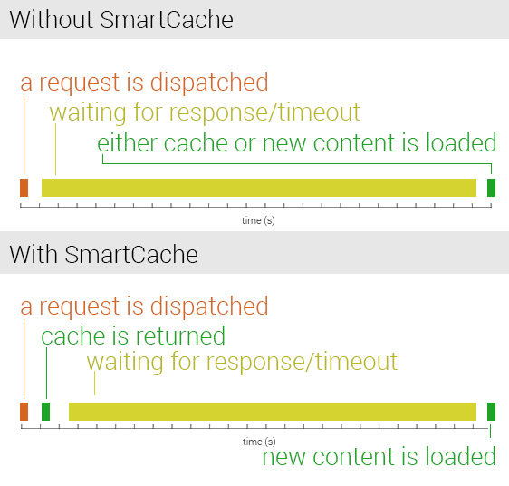

## Introduction

SmartCache is a library that offers an additional caching layer for the popular HTTP type-safe client - [Retrofit 2](http://square.github.io/retrofit/).

Some of the features provided are:

* Memory-based caching
* Instant cache responses (cache is read before the network request is started)
* Adapter/extensibility support

**NOTE:** SmartCache is an additional layer of caching, so you can (and should) keep the standard HTTP caching offered by Retrofit.

## Download and use
    
1\. To integrate it in your app, enable the `SmartCallFactory`:

    SmartCallFactory smartFactory = new SmartCallFactory(BasicCaching.fromCtx(this));
    Retrofit retrofit = new Retrofit.Builder()
        .baseUrl("http://myapi.com")
        .addCallAdapterFactory(smartFactory) // add this!
        .build();
        
2\. Replace all your `Call<T>`s with `SmartCall<T>`s:

    public interface GitHubService {
      @GET("/users/{user}/repos")
      SmartCall<List<Repo>> listRepos(@Path("user") String user);
    }
    
## How it works

SmartCache isn't constrained by the 1 response per request limit that Retrofit imposes. This means that your asynchronous callbacks will first get called when cache is loaded, and then when the network response is ready.

## Documentation

#### SmartCallFactory

    public SmartCallFactory(CachingSystem cachingSystem);

Instantiates the factory that handles `SmartCall`s, where `cachingSystem` is an instance that implements a caching system. This factory should be added to Retrofit using `addCallAdapterFactory()`:

    Retrofit retrofit = new Retrofit.Builder().addCallAdapterFactory(new MyCachingSystem()).build();
    
#### SmartCall
    
This interface specifies the call instance that you will get when using your API services.  Methods provided:

* `void enqueue(Callback<T>)` - enqueues a request. `callback` will be called with cached or networked response
* `SmartCall<T> clone()` - creates an identical call. Useful when you have query params and you don't want to initialize everything again
* `Response<T> execute()` - executes a blocking call (!). **Note:** no smart caching will be done.
* `void cancel()` - cancels the encapsulated request if it hasn't started

You **must** use `SmartCall`s when defining your services if you want smart caching:

    interface MyAPI{
        @GET("/me")
        SmartCall<User> getMe();
    }

#### BasicCaching

Basic implementation of a caching system that uses memory and disk LRU space to save responses. Caches GET requests only by default.

Constructing it from a context loads optimal values:

    CachingSystem system = BasicCaching.fromCtx(this); // loads optimal values

If you want to set your own values use the constructor, or override methods:

    CachingSystem system = new BasicCaching(
        new File(getCacheDir(), "myDir"), // caching dir
        1024 * 1024, // max disk size
        50 // max memory entries
    );